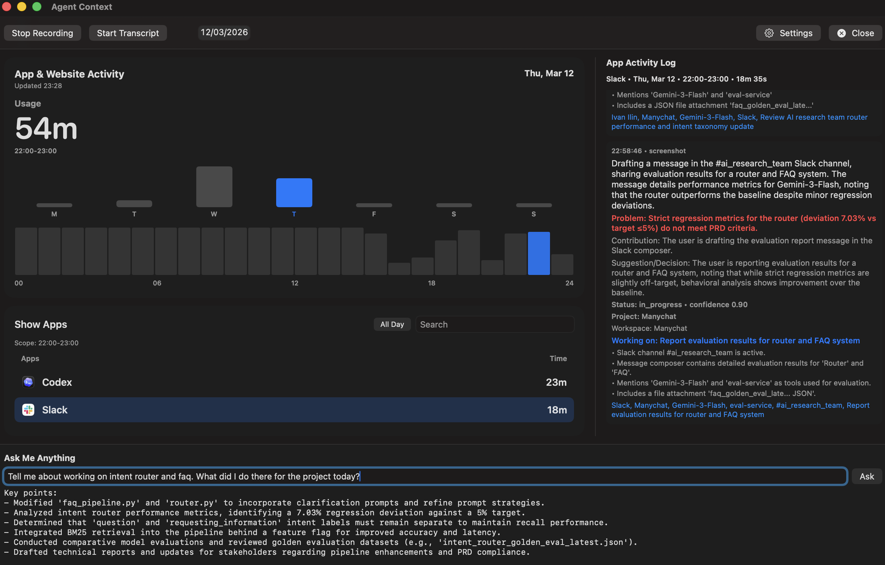

# agent-context

Agent perception layer for personal computing. Turns real computer activity into queryable context and memory for AI agents.

Stop briefing your agent like an intern.

If you are tired of copy-pasting updates, losing context between tools, and re-explaining what you were doing 10 minutes ago, this is for you.

agent-context is a local-first macOS perception layer that continuously captures rich work context and turns it into queryable memory for agents.

Think: time tracker + semantic memory.
- who you were talking to and what the thread was about
- what file, doc, or page you were inside
- what work moved forward
- what was left unfinished

It also ships with a native menu bar app, so it works as a practical day-to-day time tracker with high-quality annotations, not just backend infrastructure.



## The Big Idea

Traditional trackers measure apps.

agent-context measures work.

Most tools give you:
- `Chrome — 2h`
- `Codex — 3h`

agent-context gives you:
- `Reviewed PR #556 and #557`
- `Debugged frontend app auth failures`
- `Drafted new feature PRD`
- `Detected unresolved follow-up: finalize attribution changes`

That is the difference between “activity data” and “agent-usable context.”

## What Your Agent Can Ask

Natural-language queries that actually matter:
1. `When did user work on X this week and what happened?`
2. `What did user forget to finalize?`
3. `What changed in user's {some_project} since yesterday?`

## Why This Is Powerful

Your local agent can call one CLI command and hydrate itself with your most recent, high-signal context before planning or execution.

```bash
agent-context query "what did I forget to finalize this week?" --json
```

- `--format text` for humans
- `--format json` for agent/tool pipelines

JSON output includes:
- `answer`, `key_points`, `supporting_events`
- `insufficient_evidence`
- retrieval-source counts (`mem0_semantic`, `bm25_store`)
- inferred time scope (`start`, `end`, `label`)

Internal CLI contract for agent builders:
- [`docs/internal-agent-cli.md`](docs/internal-agent-cli.md)
- [`docs/agent-cli-integration.md`](docs/agent-cli-integration.md)

Claude Code integration (one-time setup, works from any repo on the same Mac):
- [`docs/claude-integration.md`](docs/claude-integration.md)

Quick connect:
```bash
cd /Users/kvyb/Documents/Code/myapps/agent-context
mkdir -p ~/.local/bin ~/.claude/skills/agent-context-memory
cp scripts/agent_context_query.sh ~/.local/bin/agent_context_query.sh && chmod +x ~/.local/bin/agent_context_query.sh
cat > ~/.claude/skills/agent-context-memory/SKILL.md <<'EOF'
---
name: agent-context-memory
description: Query local Agent Context memory (Mem0 + BM25) to answer what the user worked on, what changed, and what may be unfinished.
argument-hint: "<question>"
---

# Agent Context Memory

Run: ~/.local/bin/agent_context_query.sh "$ARGUMENTS"
EOF
```

Then in Claude Code (any repo on the same Mac), ask:
- `Use agent-context-memory: what did I work on today?`

## How It Works

```text
screen/audio capture
-> artifact inference (LLM)
-> structured timeline + summaries
-> local memory store + Mem0 ingestion
-> natural-language retrieval for agents
```

Current architecture:
- `Domain`: immutable data models/contracts
- `Application`: query orchestration, BM25 ranking, scope parsing, formatting
- `Infrastructure`: SQLite, Mem0, OpenRouter/OpenAI-compatible gateways
- `Presentation`: menu bar UI + CLI

Product spec:
- [`docs/ideal-product-plan.md`](docs/ideal-product-plan.md)

## Local-First, Private by Default

Primary data stays local:
- screenshots/audio under `~/.agent-context/`
- SQLite activity DB at `~/.agent-context/reports/activity.sqlite`
- local Mem0 history DB + local vector store path
- screenshot/audio retention TTL is configurable in Settings (default 3 days each)

Inference is provider-flexible as long as it is OpenAI-compatible API format.
This setup is commonly used with OpenRouter under a no-retention policy configured at the account/provider level.

## Cost in Practice (Real Snapshot)

Source of truth: `llm_usage_events.estimated_cost_usd` in local SQLite.

Snapshot from real local usage data on **March 12, 2026**:
- average across logged days: `$0.2566/day`

These numbers depend on your model choice and capture volume.
Suggested model: google/gemini-3.1-flash-lite-preview

## Run

Self-hosted install (no signing keys required):

```bash
./scripts/install.sh
```

This installs:
- repo checkout at `~/agent-context`
- app bundle at `~/Applications/Agent Context.app`
- env file at `~/.agent-context/.env` (user-managed)
- CLI symlink at `~/.local/bin/agent-context` for other agents/tools

Check/update from GitHub `main`:

```bash
./scripts/update.sh --status
./scripts/update.sh --apply
```

App mode:

```bash
swift run agent-context
```

CLI tracking mode:

```bash
swift run agent-context --cli
```

Query mode:

```bash
agent-context query "what did I work on today?" --json
swift run agent-context --query "what did I work on today?" --format text
swift run agent-context --query "what did I work on today?" --format json
```

Set work/chat identity aliases (used for authorship inference in screenshots):

```bash
swift run agent-context --set-user-aliases "Jane Doe, @jane, jane.doe"
```

Tests:

```bash
swift test
```

Build app bundle:

```bash
./scripts/build_macos_app.sh
```
